# Intune Settings Catalog in Microsoft365DSC

## Table of contents

1. [Introduction](#introduction)
1. [Settings Catalog](#settings-catalog)

    1. [Settings Catalog Structure](#settings-catalog-structure)
    2. [Setting (Definition) Properties](#setting-definition-properties)
    3. [Setting Instances](#setting-instances)
    4. [Settings in even more detail!](#settings-in-even-more-detail)

1. [Generating DSC Resources from the Settings Catalog](#generating-dsc-resources-from-the-settings-catalog)

    1. [Generating the DSC Resource](#generating-the-dsc-resource)
    2. [Issue #1: Uniqueness](#issue-1-uniqueness)
    3. [Issue #2: Groups of settings](#issue-2-groups-of-settings)

1. [From Configuration back to the Settings Catalog](#from-configuration-back-to-the-settings-catalog)

    1. [Build the settings body from the DSC properties](#build-the-settings-body-from-the-dsc-properties)

1. [The C# Engine](#the-c-engine)

    1. [The Boundary Pattern](#the-boundary-pattern)
    2. [Building the API body from DSC parameters](#building-the-api-body-from-dsc-parameters)
    3. [Exporting Settings Catalog data back to DSC](#exporting-settings-catalog-data-back-to-dsc)
    4. [Policies with Device and User scopes](#policies-with-device-and-user-scopes)

1. [Wrapping up](#wrapping-up)

## Introduction

Microsoft365DSC covers many areas of Desired State Configuration for the Microsoft cloud. One of those areas is Microsoft Intune: Configuring and administrating devices, policies and associating users / groups with their respective settings, so that each and every user / device is correctly set up and ready to work in a secure and well defined environment.

There are many policies in Intune: From "normal" device configuration policies to Endpoint Security, reporting and so many more. As time goes, these policies are updated and groups of settings (summarized in so called "templates") are updated, deleted or newly added. Sometimes even the entire architecture changes, for example right now with the Settings Catalog. The Settings Catalog is the new, unified way of managing settings in Intune. It is a central place where all settings are stored and can be used in different policies.

Not all settings are yet available in the Settings Catalog, but Microsoft is working on it. What's more important, is that current policies and templates are being replaced with the new settings in the Settings Catalog. For Microsoft365DSC, this means that previous resources must be updated or even entirely new resources must be created.

In this blog post, we will cover the Settings Catalog in Microsoft365DSC and how it in itself is structured, how it is used and how it is implemented in the DSC resources.

## Settings Catalog

The Settings Catalog is the new way of managing settings in Intune. There are two types of Settings Catalog policies:

1. A general, "normal" policy, which is a collection of settings that you can pick and choose from. This policy is available in e.g. Devices > Configuration > Create > New policy, where you can select the platform and then "Settings catalog" in the Profile type dropdown.
2. A pre-defined template, which is a collection of settings that are fixed and no settings can be added or removed. Such a policy is available in e.g. Endpoint Security > Firewall > Create policy. Be aware that there is not necessarily a visible way for you to tell if a policy is a template from the Settings Catalog or not.

The Settings Catalog is structured in a way so that you can easily find the settings you are looking for. It is divided into many different categories, which then contain their corresponding settings. Each setting has a name, a description, (most of the times) a default value and either a list of possible values or a definition of what can be entered (e.g. a string or a number, ranging from x to y). This category structure makes it quite easy to find the setting we are looking for and to understand what it does. At least in the portal, that is.

Following is a pre-defined template of the *Windows Firewall* policy in the Endpoint Security > Firewall part of Intune:

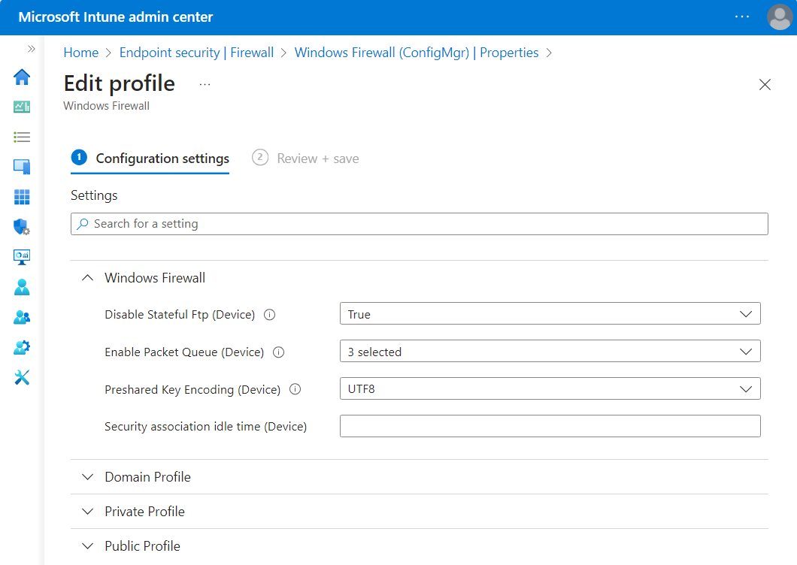

### Settings Catalog Structure

In general, the Settings Catalog is just a huge collection of settings. As already mentioned, it is  organized by categories, where each category might have subcategories and where the settings live. This looks like the following in the portal:

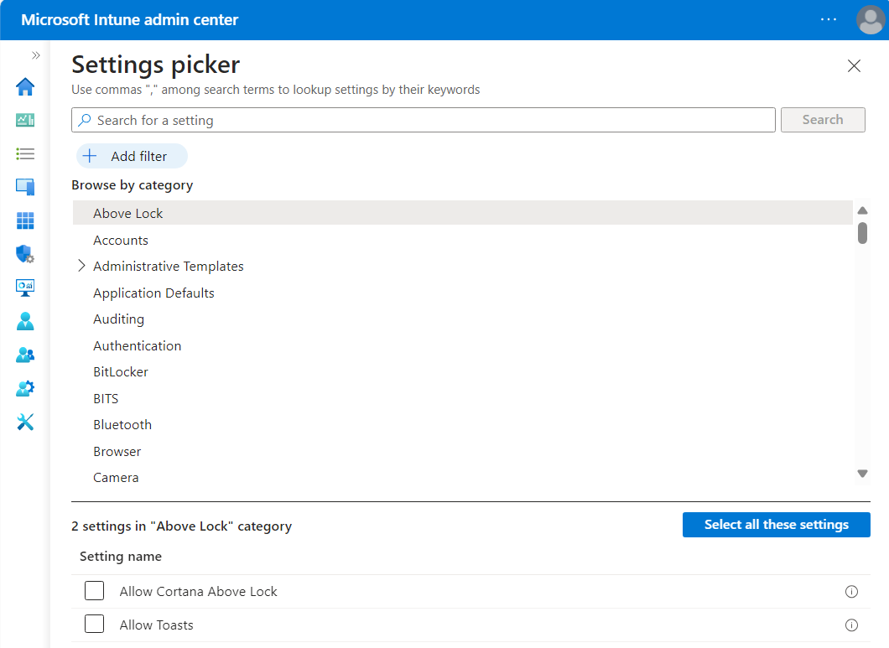

If we want to, we can fetch these categories ourselves like the following:

```powershell
# Using Graph API because the cmdlet Get-DeviceManagementConfigurationCategory is not available
$categories = Invoke-MgGraphRequest -Uri "https://graph.microsoft.com/beta/deviceManagement/configurationCategories" | Select-Object -ExpandProperty value
```

At the moment, there are 943 of those categories. After selecting a category in the UI, the settings are listed at the bottom of the page. The settings are obtainable like the following (example for the "Above Lock" category):

```powershell
$categoryId = $categories | Where-Object { $_.displayName -eq "Above Lock" } | Select-Object -ExpandProperty Id
$settings = Get-MgBetaDeviceManagementConfigurationSetting -Filter "categoryId eq '$categoryId'"
$settings | Format-List
```

This returns the following output:

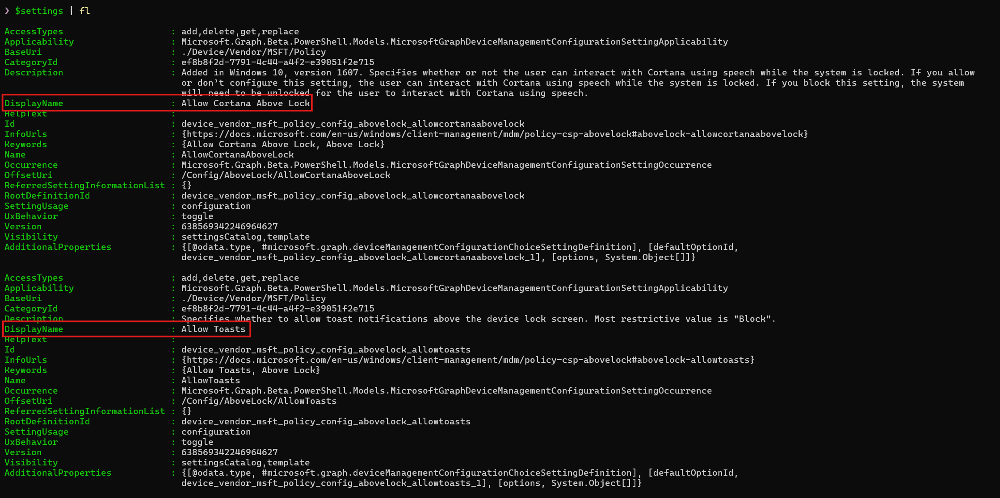

As we can see, the DisplayName is the name of the settings, as shown in the image of the portal. There are a number of other properties, like the Description, Id, and so on.

Let's dig a bit deeper into the settings themselves.

### Setting (Definition) Properties

We previously had a look at the settings, fetched directly from the Graph API. Those settings we got are so called "setting definitions", meaning they are just the definition of a setting, but they are not the actual setting. The actual setting is a so called "setting instance" with a corresponding value property, which is then applied to a device. This will be covered in the next section.

Let's have a look at the properties of the setting definitions. A full list of them is available here: [Device Management Configuration Setting Definition](https://learn.microsoft.com/en-us/graph/api/resources/intune-deviceconfigv2-devicemanagementconfigurationsettingdefinition?view=graph-rest-beta)

The most important properties are:

- `DisplayName`: The name of the setting, as shown in the portal.
- `Description`: A description of the setting, explaining what it does.
- `Id`: The Id of the setting, which is unique.
- `Name`: The actual name of the setting, not pretty formatted.
- `@odata.type`: The type of the setting.

There are many more properties, but those are the most important ones. The `@odata.type` property has a special role, because depending on which type it represents, the setting has different additional properties (like defaultOptionId, options, and so on).

### Setting Instances

The setting instances are the actual settings that are applied and the representation of the definition as a setting. In it, the value of the setting is specified. We can fetch the configured settings of a policy like the following:

```powershell
$policies = Get-MgBetaDeviceManagementConfigurationPolicy
$policy = $policies | Where-Object { $_.Name -eq "My Policy" }
$policySettings = Get-MgBetaDeviceManagementConfigurationPolicySetting -DeviceManagementConfigurationPolicyId $policy.Id
($policySettings).SettingInstance | ConvertTo-Json -Depth 5
```

This returns the following output (still our example for the "Above Lock" category):

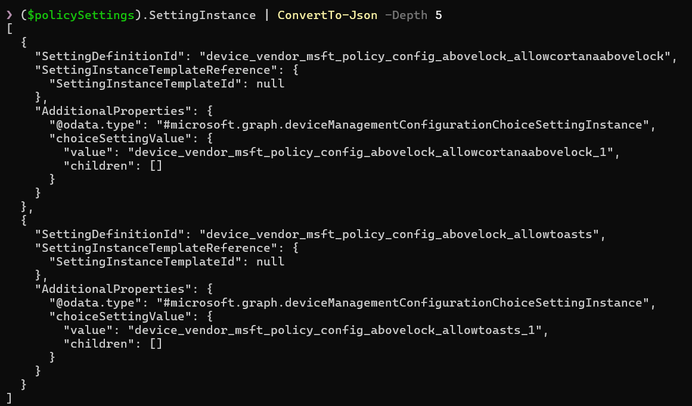

Those are the actual settings that are applied when the policy is assigned. As the first property, we have `SettingDefinitionId`, which is the fully qualified Id of the setting. It links to the setting definition with that id that can be fetched with the above call as well (using `-ExpandProperty settingDefinitions`). Next is (if available) the `SettingInstanceTemplateReference`. The template reference might not exist, as it is (most likely, not quite sure, but the name indicates it) only available for templates.
In the `AdditionalProperties`, we have the representation of the value, in this case, both values are of type `#microsoft.graph.deviceManagementConfigurationChoiceSettingInstance`, are configured to "Enabled" (value 1 at the end), and have no children.

*Note*: Setting instances aren't only used when fetching the settings (and their values), but also when we fetch a template. Then it's called a `SettingInstanceTemplate`. The template is built from these setting instance templates, where they represent a "top-level" setting or a group of settings. More on that later.

### Settings in even more detail!

There are many settings available, but if we have a closer look at them, we can quickly see similarities. Let's take the "Above Lock" category again, with the two settings `Allow Cortana Above Lock` and `Allow Toasts`. Both settings are "choice" settings, meaning they have a number of options to choose from.

Following are all of the different types of settings that are available (from the point of the setting definition). To make it easier to read, the prefix `#microsoft.graph.deviceManagementConfiguration` was removed from all types.

| Type | Description | Additional Properties | Possible values |
|------|-------------|-----------------------|-----------------|
| `SettingDefinition` | The base type of all settings. | `displayName`, `description`, `id`, `name`, `@odata.type`, ... | - |
| `SettingGroupDefinition` | Collection of settings. No active use found. | `childIds` | - |
| `SettingGroupCollectionDefinition` | Extends `SettingGroupDefinition`. Collection of settings that can appear x times. Not shown directly in the UI. | `minimumCount`, `maximumCount` | - |
| `ChoiceSettingDefinition` | A choice setting, where you can choose one element from a number of options, represented as a dropdown. | `defaultOptionId`, `options` | Value from x to y, according to the dropdown values |
| `ChoiceSettingCollectionDefinition` | Extends `ChoiceSettingDefinition`. Similar to a choice setting, but multiple values can be selected from a number of options. | `minimumCount`, `maximumCount` | Collection of choice settings |
| `SimpleSettingDefinition` | A simple setting, where you can set a value. Can contain the value types `StringSettingValue` and `IntegerSettingValue`| `defaultValue`, `valueDefinition` | asdf, 1234 |
| `SimpleSettingCollectionDefinition` | Extends `SimpleSettingDefinition`. A collection of simple settings. | `minimumCount`, `maximumCount` | Collection of values like asdf, 1234 |

Here's the inheritance tree of the setting types:
```
SettingDefinition
├───SettingGroupDefinition
│   ├─── SettingGroupCollectionDefinition
├───ChoiceSettingDefinition
│   ├─── ChoiceSettingCollectionDefinition
├───SimpleSettingDefinition
│   ├─── SimpleSettingCollectionDefinition
```

Pretty simple structure actually, we have a base type `SettingDefinition` and then three types that inherit from it. For each of those types, there is a corresponding collection type, which is used when multiple settings of that type are either selectable or can be entered.

There is a bit more to some of the types. Let's have a look at them in more detail.

#### Simple Settings

The types `SimpleSetting*Definition` are types that are used for settings where you can input a value. In terms of complexity, they are the easiest to understand. The following input types are available:

| Type | Description |
|------|-------------|
| `StringSettingValue` | A normal string value. |
| `IntegerSettingValue` | A normal integer value. |
| `SecretSettingValue` | A secret value. Not used very often, contains either the encrypted value (when GET) or unencrypted (when POST/PUT). |

Below is an example of a collection of simple settings, taken from the Bitlocker category:

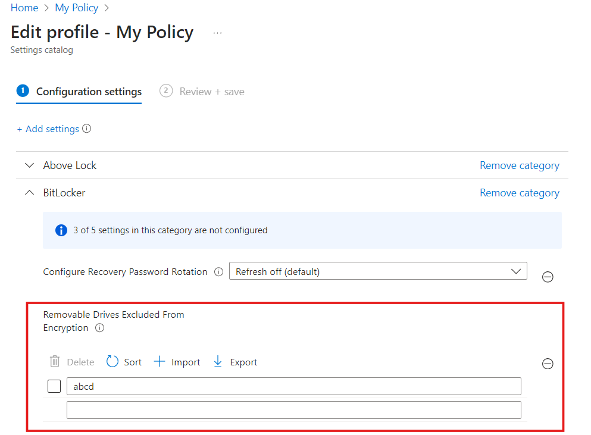

#### Choice Settings

The types `ChoiceSetting*Definition` are used for settings where you can choose from a number of options. Let's have a look at the options of the settings in the Above Lock category, pretty printed:

```powershell
# settings are the same as in the previous example
$settings | Select-Object DisplayName, @{
    Name = "Options"
    Expression = {
        $_.AdditionalProperties.options.displayName
    }
}, @{
    Name = "Value"
    Expression = {
        $_.AdditionalProperties.options.optionValue.value
    }
}, @{
    Name = "Type"
    Expression = {
        $_.AdditionalProperties.options.optionValue.'@odata.type'
    }
} | Format-List
```

This returns the following output:
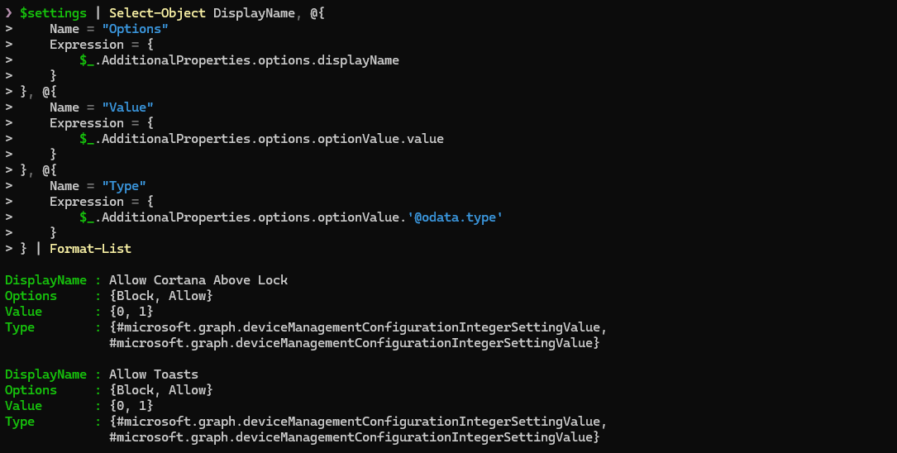

As we can see, their underlying type is the `IntegerSettingValue`. Since we don't know if that's always the case, we have to consider that `StringSettingValue` might also be possible as a type, although unlikely.

If there are more than two or other options (not just "Enabled" and "Disabled"), then usually a dropdown is used to select the value from. An example of this is the `Configure Recovery Password Rotation` setting in the Bitlocker category, that has three options to choose from.

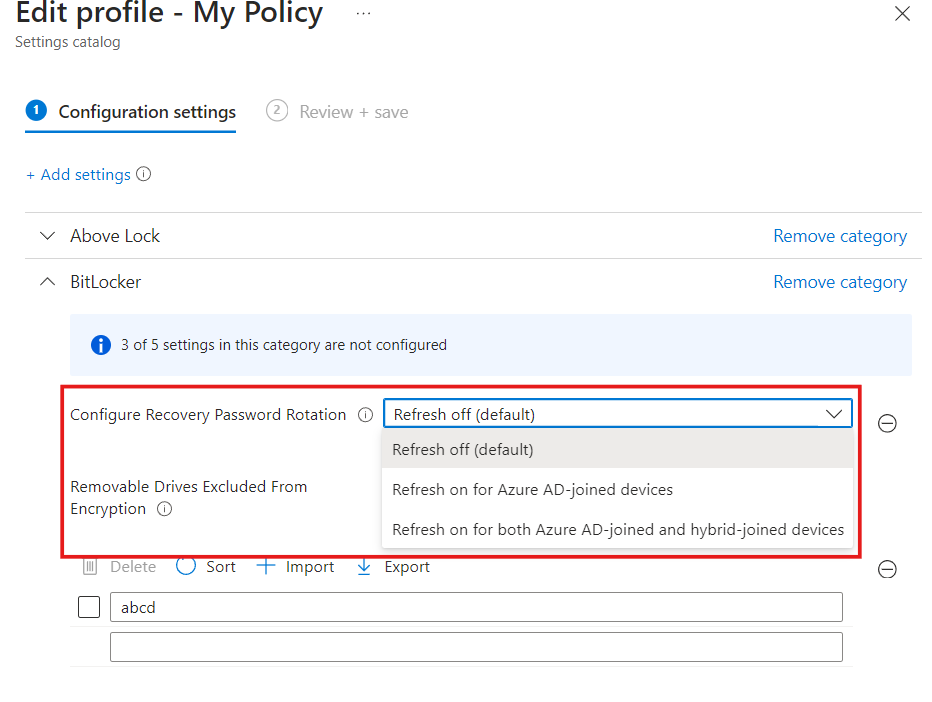

#### Group Settings

The types `SettingGroup*Definition` (more specifically the `SettingGroupCollectionDefinition` type) are used for settings where multiple settings are grouped together. The `childIds` property is used to reference the settings that are part of the group, and the `minimumCount` and `maximumCount` properties are used to define how many times that group can appear.

This looks like the following, when we take the template for `Microsoft Defender Antivirus`:

```powershell
# Microsoft Defender Antivirus template
$templateId = "804339ad-1553-4478-a742-138fb5807418_1"
$settingTemplates = Get-MgBetaDeviceManagementConfigurationPolicyTemplateSettingTemplate -DeviceManagementConfigurationPolicyTemplateId $templateId -ExpandProperty "settingDefinitions" -All

# The settings for "Threat Severity Default Action" are in a group
# Remember that the group is not directly visible in the UI, but the child settings are
$template = $settingTemplates | Where-Object { $_.SettingInstanceTemplate.settingDefinitionId -eq "device_vendor_msft_policy_config_defender_threatseveritydefaultaction" }

# The SettingInstanceTemplate defines the structure of the setting
$template.SettingInstanceTemplate | Select-Object SettingDefinitionId, @{
    Name = "ChildSettings"
    Expression= {
        $_.AdditionalProperties.groupSettingCollectionValueTemplate.children.settingDefinitionId
    }
} | Format-List
```
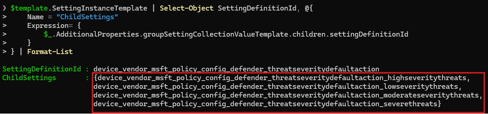

As we can see, there are five settings in total, where the `Threat Severity Default Action` is the group setting and the other settings are the children. Those are `High Severity Threats`, `Low Severity Threats`, `Moderate Severity Threats` and `Severe Severity Threats`.

Now remember that we talked about `SettingInstance` and `SettingInstanceTemplate`? Since the `SettingInstanceTemplate` "only" defines the root structure of the setting, we have to look at the setting definitions for further information about how they are defined, if there are dependencies between them, and so on. This becomes very important when we want to generate DSC resources from the Settings Catalog.

## Generating DSC Resources from the Settings Catalog

We have now seen that the Settings Catalog is quite complex due to the many different types of settings and their structure. This makes it very challenging to generate DSC resources from the Settings Catalog, because we can only represent a Settings Catalog template as a DSC resource due to its fixed settings and not an individual policy where all settings are configurable.

In this section, we will take a look at how we can generate DSC resources from the Settings Catalog. We will use the `Microsoft Defender Antivirus` template as an example, visible in the portal under Endpoint Security > Antivirus > Create policy > Windows 10... > Microsoft Defender Antivirus.

### Generating the DSC Resource

To generate the DSC resource, we first have to fetch the template and what's inside it. We can do this like the following:

```powershell
# Microsoft Defender Antivirus Template
$templateId = "804339ad-1553-4478-a742-138fb5807418_1"
$settingTemplates = Get-MgBetaDeviceManagementConfigurationPolicyTemplateSettingTemplate -DeviceManagementConfigurationPolicyTemplateId $templateId -ExpandProperty "settingDefinitions" -All
$settingTemplates | Format-List
```

This gives us all the setting instance templates and their corresponding setting definitions. There are a lot of those instance templates (56 to be exact) and even more settings inside them (60: 56 of the instance templates + 4 of the Threat Severity Default Action group).

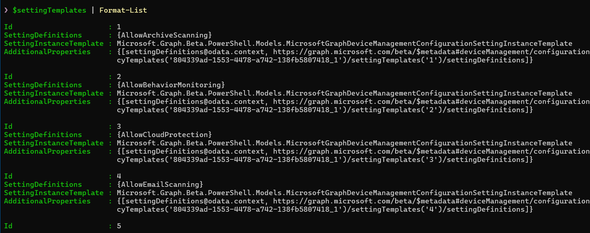

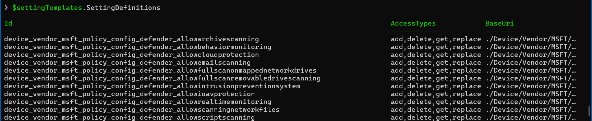

Now we need to think back a bit: What do we actually want to have in our final DSC resource? Our goal is to have all the settings of the template exported and available in the DSC resource. How do we achieve that?

First, we have to iterate over all setting instance templates, since they define what is at the "top-level" (for now referred to as "root" level) of that group. Inside each instance template, we grab the instance template(s), go for its setting definition(s), and then check what other setting definitions are available and go over them as well, while grabbing their type, possible values, description, name and so on. Everything that's needed for us to create the DSC resource. Some other checks are also necessary. The entire Create Flow looks like the following:

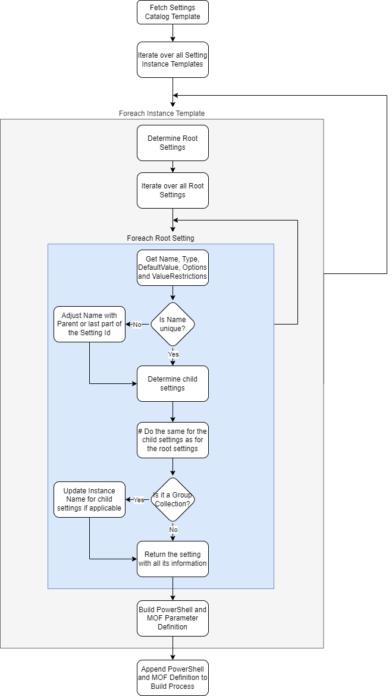

As soon as the DSC Resource is created and added to the module release, it can be used to export the configuration from the tenant using `Export-M365DSCConfiguration`.

But before that, there are a couple of issues we first need to discuss that appear when using the Settings Catalog.

### Issue #1: Uniqueness

The next problem we have is much more difficult to deal with: Inside of the Settings Catalog, the `Name` of a setting does not have to be unique, only the `Id`. This means that inside of a template, we need a more sophisticated way to uniquely identify a setting.

The name resolution in Microsoft365DSC lives in the C# class `SettingsCatalogHelper` (more on the C# engine later). The method `GetSettingName()` implements the following strategy:

1. First it grabs the `Name` of the setting and cleans up invalid characters (curly braces, dollar signs) and replaces spaces with underscores.
2. Then it checks if there is another setting in the template with the same name.
3. If there is, it looks up the parent setting (via `dependentOn.parentSettingId`) and combines that parent's name with the current setting name.
4. If that combination is still not unique, it traverses up the `OffsetUri` of the setting to find a distinguishing prefix. The `OffsetUri` is basically the path-like identifier of where the setting lives in the CSP (Configuration Service Provider) tree, so walking up that path often gives us a meaningful and unique prefix.
5. As a very last resort, it falls back to deriving the name from parts of the setting definition Id.

Here is the core of `GetSettingName` in C#:

```csharp
public static string GetSettingName(
    SettingDefinitionInfo settingDefinition,
    List<SettingDefinitionInfo> allSettingDefinitions)
{
    string settingName = Regex.Replace(settingDefinition.Name, @"[\{\}\$]", "");
    settingName = settingName.Replace(' ', '_');

    var settingsWithSameName = allSettingDefinitions
        .Where(s => s.Name.Equals(settingName, StringComparison.OrdinalIgnoreCase))
        .ToList();

    if (settingsWithSameName.Count > 1)
    {
        // Try combining with parent setting name
        var parentSetting = GetParentSettingDefinition(settingDefinition, allSettingDefinitions);

        if (parentSetting is not null)
        {
            // Check if parent+name combination is unique
            List<SettingDefinitionInfo> combinationMatchesWithParent = [];
            foreach (var s in settingsWithSameName)
            {
                var innerParent = GetParentSettingDefinition(s, allSettingDefinitions);
                if (innerParent is not null)
                {
                    if ($"{innerParent.Name}_{s.Name}".Equals(
                        $"{parentSetting.Name}_{settingName}",
                        StringComparison.OrdinalIgnoreCase))
                    {
                        combinationMatchesWithParent.Add(s);
                    }
                }
            }

            if (combinationMatchesWithParent.Count == 1)
            {
                settingName = parentSetting.Name + "_" + settingName;
            }
            else
            {
                // Try disambiguating via OffsetUri traversal
                var result = GetUniqueNameFromMultipleMatches(
                    settingDefinition, settingName, settingsWithSameName);
                if (result.Success)
                    settingName = result.SettingName;
                else
                {
                    // Fallback: derive from parent setting Id
                    // ...
                }
            }
        }

        // Apply name simplification rules for readability
        settingName = ApplyNameSimplification(settingName);
    }

    return settingName;
}
```

The `GetUniqueNameFromMultipleMatches` method is interesting: it walks up the `OffsetUri` segments (something like `/Config/AboveLock/AllowCortanaAboveLock`) and prepends the nearest unique segment to the setting name. This iterative upward traversal continues until the name is unique or a threshold (8 iterations) is reached.

On top of that, `ApplyNameSimplification` cleans up names that end up overly long from the OffsetUri traversal. It uses a data-driven set of rules. For example, a setting name starting with `microsoft_edge~Policy~microsoft_edge~` gets simplified to `MicrosoftEdge_`, and one containing `~L_TrustCenter` becomes `_TrustCenter`. These rules keep the parameter names human-readable while staying unique.

For any setting out there, this will deterministically generate its name, either by directly taking its name, by combining it with its parent setting, by walking up the OffsetUri, or by taking parts of the definition id. Fortunately for us, PowerShell allows parameters with underscores, e.g. `$setting_name_1234`.

### Issue #2: Groups of settings

The third issue is simply the type `SettingGroupCollectionDefinition`. That type is difficult to handle if it can appear more than one time.

As an example: Let's take the group collection `Threat Severity Default Action` and its four settings. If that group only appears one time, we can directly add the four settings to the DSC resource, because the settings can never appear more than once. But what if that group could be added for e.g. multiple directories? Then adding the settings multiple times would not be possible, as the parameter names in the DSC resource must be unique.

The solution Microsoft365DSC is using is to create a custom type for a group collection that can appear multiple times, adding the child settings to that type. That way, we can use the newly created type and specify that multiple times, without having any issues with uniqueness.

In the C# implementation, this multi-instance detection happens inside `SettingCatalogPolicySettingBuilder.BuildGroupSettingCollectionValue()`. The logic checks whether a group collection can have more than one instance and whether it has multiple child definitions:

```csharp
// Multi-instance detection
bool isMultiInstance =
    (level > 1 && childDefinitions.Count > 1) ||
    (level == 1 && settingDefinition.MaximumCount > 1 &&
     childDefinitions.Count >= 1 &&
     !childDefinitions.Any(c => string.Equals(
         c.ODataType,
         SettingGroupCollectionDefinitionType,
         StringComparison.OrdinalIgnoreCase)));
```

When a group is multi-instance, the builder looks for a matching CIM instance in the DSC parameters (using `FindCimInstancesByClassName`) and iterates over each instance, building the child settings for each one. The class name of the CIM instance is derived from the parent instance name plus the setting name, matching the custom type that was created during resource generation.

This is also where DSC resources like `IntuneDeviceControlPolicyWindows10` get special handling: when there is a single child definition with `maxCount=1` but the group itself can repeat, each inner group value gets wrapped in its own parent group to match the Graph API's expected structure.

## From Configuration back to the Settings Catalog

After exporting the configuration in its DSC resource, we have to be able to convert that back to something we can feed to the Settings Catalog.

As an example, the following is the JSON request for configuring parts of the Microsoft Defender Antivirus Template:

```json
{
   "settings":[
      {
        "id": 0,
         "settingInstance":{
            "@odata.type":"#microsoft.graph.deviceManagementConfigurationSimpleSettingCollectionInstance",
            "settingDefinitionId":"device_vendor_msft_policy_config_defender_excludedpaths",
            "settingInstanceTemplateReference":{
               "settingInstanceTemplateId":"867f7498-1484-443f-bf6a-f12abb1f2f60"
            },
            "simpleSettingCollectionValue":[
               {
                  "@odata.type":"#microsoft.graph.deviceManagementConfigurationStringSettingValue",
                  "settingValueTemplateReference":null,
                  "value":"C:\\temp"
               },
               {
                  "@odata.type":"#microsoft.graph.deviceManagementConfigurationStringSettingValue",
                  "settingValueTemplateReference":null,
                  "value":"C:\\temp2"
               }
            ]
         }
      },
      {
         "@odata.type":"#microsoft.graph.deviceManagementConfigurationSetting",
         "settingInstance":{
            "@odata.type":"#microsoft.graph.deviceManagementConfigurationChoiceSettingInstance",
            "choiceSettingValue":{
               "@odata.type":"#microsoft.graph.deviceManagementConfigurationChoiceSettingValue",
               "children":[],
               "settingValueTemplateReference":{
                  "settingValueTemplateId":"2d790211-18cb-4e32-b8cc-97407e2c0b45"
               },
               "value":"device_vendor_msft_policy_config_defender_puaprotection_1"
            },
            "settingDefinitionId":"device_vendor_msft_policy_config_defender_puaprotection",
            "settingInstanceTemplateReference":{
               "settingInstanceTemplateId":"c0135c2a-f802-44f4-9b71-b0b976411b8c"
            }
         }
      }
   ]
}
```

Did somebody say complex? Well, at first glance it definitely is! But if we have a closer look, it's all well structured:

We have two settings: `excludedpaths` with the simple setting values `C:\temp` and `C:\temp2` (type `SimpleSettingCollection`), and `puaprotection` with the choice `1` (type `ChoiceSetting`). They are both in their `settingInstance`, and the eagle-eyed can see that the values are defined in a property with the name (type + `Value`). Additionally, some information about that setting instance is added (the `settingInstanceTemplateId`) and what its `settingDefinitionId` is. All of this information is obtainable by getting the policy template, as we did at the beginning of the blog post.

### Build the settings body from the DSC properties

Building the body that we then feed to the Graph API is not that simple, but with the right approach, we can do that without too many issues.

The approach Microsoft365DSC uses is almost the same as when generating a DSC resource: We fetch the current template information, iterate over all instance templates, and build the settings tree from there. The following diagram shows the process:

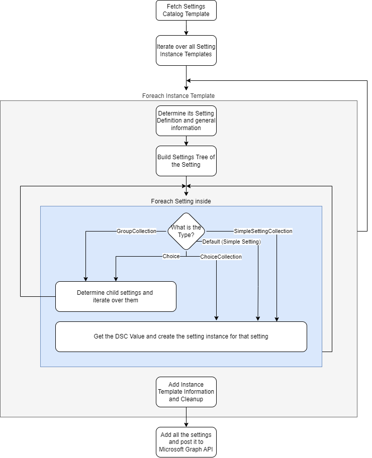

The most interesting part is the switch case for the setting type, because depending on the type, other logic is needed to create the setting instances.

For the `GroupSettingCollection` and `ChoiceSetting`, we first determine the child settings and recursively build these settings first.

For the other types `SimpleSettingCollection`, `ChoiceCollection` and Default (which is actually `SimpleSetting`), we want the DSC value (if configured) and then return that setting. This can be achieved by iterating over the DSC properties, disassembling the name (remember that could be the normal `Name`, or combined with the parent, or the last part of the definition id) and finding the associated setting definition.

Now, all of this used to be pure PowerShell. But as the number of settings grew (some templates have 60+ definitions!) and the recursive traversal became more complex, we hit a wall in terms of performance and maintainability. That is when the C# engine was born. Let's take a closer look at it.

## The C# Engine

When we first built the Settings Catalog support in Microsoft365DSC, everything was PowerShell. And honestly, that worked just fine - for a while. But as more templates were added and the recursive setting traversal got deeper and more complex, things started to slow down. We were doing a lot of reflection on Graph SDK objects, walking through `AdditionalProperties` dictionaries on every single recursive call, and the PowerShell pipeline overhead for 60+ setting definitions per template started to add up.

So we made the call to move the core conversion logic to C#. The algorithm stays the same, the flow diagrams above are still accurate. But the implementation now lives in a dedicated `Microsoft365DSC.Intune` assembly (targeting `netstandard2.0` so it works everywhere PowerShell does). PowerShell still handles all the Graph API calls to fetch templates and policies. The C# code takes over for the heavy lifting: mapping the raw Graph objects, resolving names, building the API request body, and exporting settings back to DSC parameters.

Here is the class diagram of the C# engine:

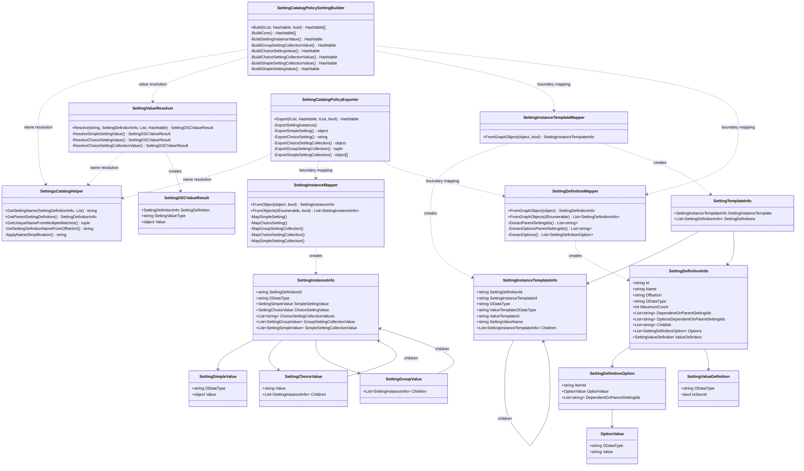

Let's walk through the key pieces.

### The Boundary Pattern

If you have ever worked with the Microsoft Graph SDK for PowerShell, you know that the interesting data on those objects is often buried inside `AdditionalProperties`. That property is not publicly accessible on the Graph SDK types - you need reflection with `BindingFlags.NonPublic | BindingFlags.Instance` to get to it. Doing that once is fine. Doing it hundreds of times during a recursive traversal? Not so much.

The C# engine solves this with what we call the "boundary pattern": at the very edge where PowerShell hands off Graph SDK objects to C#, we map everything into strongly-typed C# models. All the reflection happens exactly once per object, right at that boundary. After that, the entire recursive traversal works with clean C# properties. No more reflection, no more dictionary lookups.

There are three mapper classes that handle this boundary:

**`SettingDefinitionMapper`** converts Graph SettingDefinition objects into `SettingDefinitionInfo`. It extracts the `Id`, `Name`, `OffsetUri`, the `@odata.type`, `options`, `childIds`, `maximumCount`, `valueDefinition`, and, critically, the parent setting IDs from both `dependentOn` and `options.dependentOn`. All that `AdditionalProperties` digging happens here, once, and then we are done with it.

```csharp
public static SettingDefinitionInfo FromGraphObject(object settingDefinition)
{
    var info = new SettingDefinitionInfo
    {
        Id = TryGetProperty(settingDefinition, "Id"),
        Name = TryGetProperty(settingDefinition, "Name"),
        OffsetUri = TryGetProperty(settingDefinition, "OffsetUri")
    };

    // Extract AdditionalProperties via reflection (NonPublic | Instance)
    // This is the expensive part, we do it once and never again
    IDictionary<string, object>? additionalProperties = ExtractAdditionalProperties(settingDefinition);

    if (additionalProperties is not null)
    {
        info.DependentOnParentSettingIds = ExtractParentSettingIds(additionalProperties, "dependentOn");
        info.OptionsDependentOnParentSettingIds = ExtractOptionsParentSettingIds(additionalProperties);
        info.Options = ExtractOptions(additionalProperties);
        // ... maxCount, childIds, valueDefinition, etc.
    }

    return info;
}
```

**`SettingInstanceTemplateMapper`** converts the raw template objects into `SettingInstanceTemplateInfo`. This one has a twist: root-level templates store their data in `AdditionalProperties`, while child templates (from the value template's `children` array) have the data at the top level. The mapper handles both cases through an `isRoot` parameter.

It also pre-computes the `SettingValueName` (like `choiceSettingValue` or `groupSettingCollectionValue`) from the OData type, so the builder does not need to recompute that string manipulation on every recursive call.

**`SettingInstanceMapper`** does the same for actual setting instances (as opposed to templates). It converts the Graph API response objects into `SettingInstanceInfo`, which holds the data in a type-specific way: `SimpleSettingValue` for simple settings, `ChoiceSettingValue` for choice settings, `GroupSettingCollectionValue` for groups, and so on. Again, root vs. child instances are handled differently because the Graph API formats them differently.

### Building the API body from DSC parameters

The entry point for building the Graph API request body is `SettingCatalogPolicySettingBuilder.Build()`. From PowerShell, it gets called like this:

```powershell
# PowerShell fetches the templates from Graph API
$settingTemplates = Get-MgBetaDeviceManagementConfigurationPolicyTemplateSettingTemplate `
    -DeviceManagementConfigurationPolicyTemplateId $TemplateId `
    -ExpandProperty 'SettingDefinitions' -All

# C# takes over for the actual conversion
return [Microsoft365DSC.Intune.SettingCatalogPolicySettingBuilder]::Build(
    [System.Collections.Generic.List[object]]@($settingTemplates),
    $DSCParams,
    $ContainsDeviceAndUserSettings.IsPresent)
```

Inside `Build()`, the first thing that happens is the boundary mapping. All Graph objects get converted to `SettingTemplateInfo` (which contains a `SettingInstanceTemplateInfo` and a list of `SettingDefinitionInfo`). From here on, zero reflection is needed.

The core loop in `BuildCore()` iterates over each setting template, finds its root definition (the one that matches the instance template's `SettingDefinitionId` and has no parent dependencies), and then calls `BuildSettingInstanceValue()` recursively. That method is essentially a big switch on the setting type:

```csharp
private static Hashtable BuildSettingInstanceValue(
    Hashtable dscParams,
    SettingDefinitionInfo settingDefinition,
    SettingInstanceTemplateInfo instanceTemplate,
    List<SettingDefinitionInfo> allDefinitions,
    List<SettingDefinitionInfo> currentDefinitions,
    string settingType, string settingValueName,
    string settingValueType, string settingValueTemplateId,
    string settingInstanceName, int level)
{
    if (IsGroupSettingCollection(settingType))
        return BuildGroupSettingCollectionValue(...);

    if (IsChoiceSetting(settingType))
        return BuildChoiceSettingValue(...);

    if (IsChoiceSettingCollection(settingType))
        return BuildChoiceSettingCollectionValue(...);

    if (IsSimpleSettingCollection(settingType))
        return BuildSimpleSettingCollectionValue(...);

    // Default: Simple settings (Integer/String)
    return BuildSimpleSettingValue(...);
}
```

Each of these builder methods follows the same pattern: find the relevant DSC parameter value using `SettingValueResolver.Resolve()`, construct the appropriate Hashtable structure that the Graph API expects, and return it. The Hashtable is used as the return type because PowerShell can directly serialize it to JSON for the API call.

**`BuildGroupSettingCollectionValue`** is the most complex one. It finds child definitions, checks for multi-instance scenarios (as we discussed in Issue #2), and recursively builds child settings. For multi-instance groups, it looks up matching CIM instances in the DSC parameters and iterates over each one.

**`BuildChoiceSettingValue`** resolves the selected option value and recursively builds any child settings that depend on the chosen option. A choice setting can have children - think of it like enabling a feature with a toggle, which then reveals additional configuration options underneath.

**`BuildSimpleSettingValue`** and **`BuildSimpleSettingCollectionValue`** are the simplest. They resolve the DSC value and wrap it in the right structure. The interesting bit here is secret handling: if the setting definition's `valueDefinition.isSecret` is true, the value type gets set to `SecretSettingValue` with a `valueState` of `NotEncrypted`.

#### Resolving DSC values

A core piece of the builder is `SettingValueResolver.Resolve()`. Its job is to take a setting definition, look up the corresponding DSC parameter by name (using `SettingsCatalogHelper.GetSettingName()`), and return the value in the format the Graph API expects.

For simple settings, this is straightforward: strings stay strings, integers stay integers. For choice settings, it gets more interesting. The DSC parameter holds a human-readable value (like `"1"` or `"enabled"`), but the Graph API wants the full option `itemId` (like `"device_vendor_msft_policy_config_defender_puaprotection_1"`). So `ResolveChoiceSettingValue` looks up the matching option by its `optionValue.value` first, and falls back to constructing the `itemId` from the definition ID plus the DSC value if needed:

```csharp
private static SettingDSCValueResult ResolveChoiceSettingValue(
    SettingDefinitionInfo settingDefinition, object dscValue)
{
    string dscValueStr = dscValue?.ToString() ?? string.Empty;

    // Try matching by optionValue.value
    string settingValue = settingDefinition.Options
        .Where(o => o.OptionValue is not null &&
            string.Equals(o.OptionValue.Value, dscValueStr,
                StringComparison.OrdinalIgnoreCase))
        .Select(o => o.ItemId)
        .FirstOrDefault();

    // Fallback: match by itemId == "{definitionId}_{dscValue}"
    if (string.IsNullOrEmpty(settingValue))
    {
        string expectedItemId = $"{settingDefinition.Id}_{dscValueStr}";
        settingValue = settingDefinition.Options
            .Where(o => string.Equals(o.ItemId, expectedItemId,
                StringComparison.OrdinalIgnoreCase))
            .Select(o => o.ItemId)
            .FirstOrDefault();
    }

    return new SettingDSCValueResult
    {
        SettingDefinition = settingDefinition,
        SettingValueType = "...ChoiceSettingValue",
        Value = settingValue
    };
}
```

### Exporting Settings Catalog data back to DSC

The other direction (taking the Graph API response and turning it into flat DSC parameters) is handled by `SettingCatalogPolicyExporter.Export()`. This is what runs during `Export-M365DSCConfiguration` when you export your tenant's Intune configuration.

Again, PowerShell handles the Graph API call and hands the results to C#:

```powershell
return [Microsoft365DSC.Intune.SettingCatalogPolicyExporter]::Export(
    $Settings,
    $ReturnHashtable,
    $AllSettingDefinitions,
    $ContainsDeviceAndUserSettings)
```

The exporter first converts all the raw Graph settings into `SettingExportItem` objects, each containing a `SettingInstanceInfo` (mapped via `SettingInstanceMapper`) and a list of `SettingDefinitionInfo` objects. Then it iterates through each setting and calls `ExportSettingInstance()`, which - you guessed it - is another recursive switch on the OData type:

```csharp
private static void ExportSettingInstance(
    SettingInstanceInfo settingInstance,
    List<SettingDefinitionInfo> settingDefinitions,
    List<SettingDefinitionInfo> allSettingDefinitions,
    Hashtable returnHashtable)
{
    var settingDefinition = settingDefinitions
        .FirstOrDefault(d => string.Equals(
            d.Id, settingInstance.SettingDefinitionId,
            StringComparison.OrdinalIgnoreCase));

    string settingName = SettingsCatalogHelper.GetSettingName(
        settingDefinition, allSettingDefinitions);

    switch (settingInstance.ODataType)
    {
        case "...SimpleSettingInstance":
            settingValue = ExportSimpleSetting(settingInstance);
            break;
        case "...ChoiceSettingInstance":
            settingValue = ExportChoiceSetting(settingInstance, ...);
            break;
        case "...ChoiceSettingCollectionInstance":
            settingValue = ExportChoiceSettingCollection(settingInstance, ...);
            break;
        case "...GroupSettingCollectionInstance":
            // Returns (Value, AddToParameters) tuple
            var groupResult = ExportGroupSettingCollection(settingInstance, ...);
            break;
        case "...SimpleSettingCollectionInstance":
            settingValue = ExportSimpleSettingCollection(settingInstance);
            break;
    }

    if (addToParameters && settingValue is not null)
        returnHashtable[settingName] = settingValue;
}
```

The export methods reverse what the builder does:

- **`ExportSimpleSetting`** extracts the value, making sure integers come back as actual `int` types (not strings).
- **`ExportChoiceSetting`** takes the full `itemId` (like `device_vendor_msft_..._puaprotection_1`) and resolves it back to the human-readable option value (like `"1"`). It also recursively exports any child settings that were configured under that choice. The reverse resolution in `ResolveChoiceOptionValue` checks if the option value contains `=` or `{}` characters. Those are assignment-style values that should fall back to the stripped itemId instead.
- **`ExportGroupSettingCollection`** is where the magic happens for groups. It has three code paths: (1) if there is only one child definition and `maxCount > 1`, it flattens directly; (2) if it is multi-instance with multiple children, it creates nested Hashtables (which become CIM instances on the PowerShell side); (3) single-instance groups just flatten their children into the parent Hashtable.
- **`ExportChoiceSettingCollection`** collects all selected values, resolves each one, and determines the output type (string array or integer array) based on the first option's value definition type.

### Policies with Device and User scopes

Some Settings Catalog policies have both device-scoped and user-scoped settings. You can recognize them by the setting definition IDs: they start with either `device_` or `user_`. In the DSC resource, these are split into `DeviceSettings` and `UserSettings` parameters, each containing their own set of properties.

Both the builder and the exporter handle this through dedicated methods (`BuildDeviceAndUserSettings` and `ExportDeviceAndUserSettings`). They split the templates or settings by prefix, extract the scope-specific DSC parameters, and then run the normal build/export logic for each scope independently. The results are then combined into the final output.

## Wrapping up

When you look at the Settings Catalog from the outside - a nice dropdown here, a toggle there - it seems pretty simple. But under the hood, there is a surprisingly deep data model with setting definitions, setting instances, templates, options, parent-child dependencies, group collections, and all the edge cases that come with them.

Microsoft365DSC bridges that gap between the Graph API's complex JSON structures and the clean, flat DSC parameters that administrators actually work with. The C# engine handles the heavy lifting:

- **`SettingsCatalogHelper`** deterministically generates unique, readable parameter names from setting definitions, all while handling duplicate names, parent prefixes, OffsetUri traversal, and name simplification.
- **`SettingCatalogPolicySettingBuilder`** takes DSC parameters and produces the Graph API request body, recursively building the right structure for each setting type.
- **`SettingCatalogPolicyExporter`** does the reverse, flattening the Graph API response back into DSC parameters.
- **`SettingValueResolver`** bridges the gap between human-readable DSC values and the Graph API's option IDs and value types.
- The **boundary mappers** (`SettingDefinitionMapper`, `SettingInstanceTemplateMapper`, `SettingInstanceMapper`) ensure that reflection into `AdditionalProperties` happens exactly once per object.

PowerShell remains the entry point: It handles Graph API calls, DSC resource lifecycle, and the module interface. The C# assembly slots in behind it, doing the data transformation work that benefits most from strong typing and raw execution speed.

If you want to dig deeper into the implementation, the full source is available in the `src/Microsoft365DSC.Intune` directory of the repository. And if you are building your own Settings Catalog resources or working with the Intune Graph API, hopefully this blog post gave you a solid understanding of how it all fits together.
